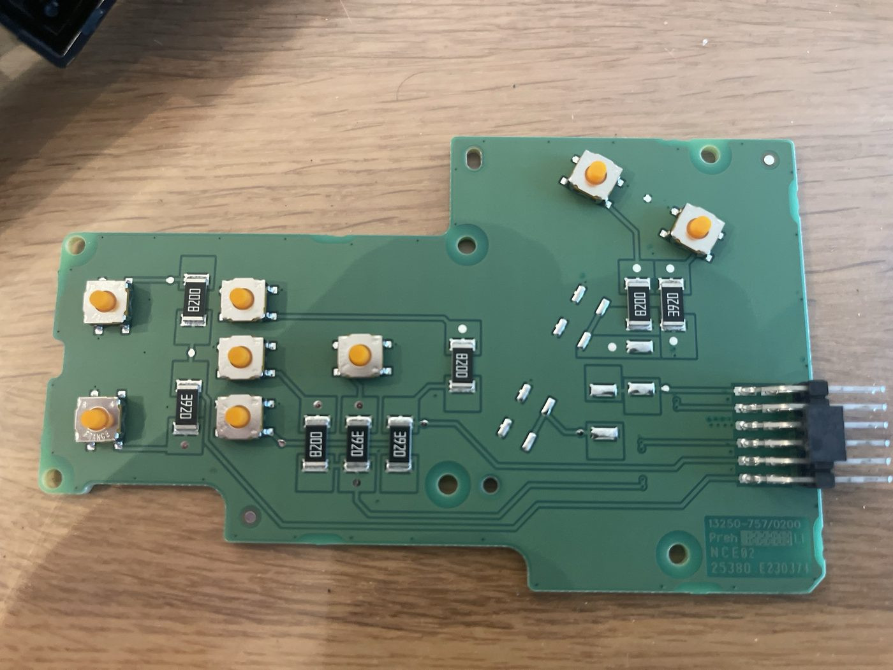
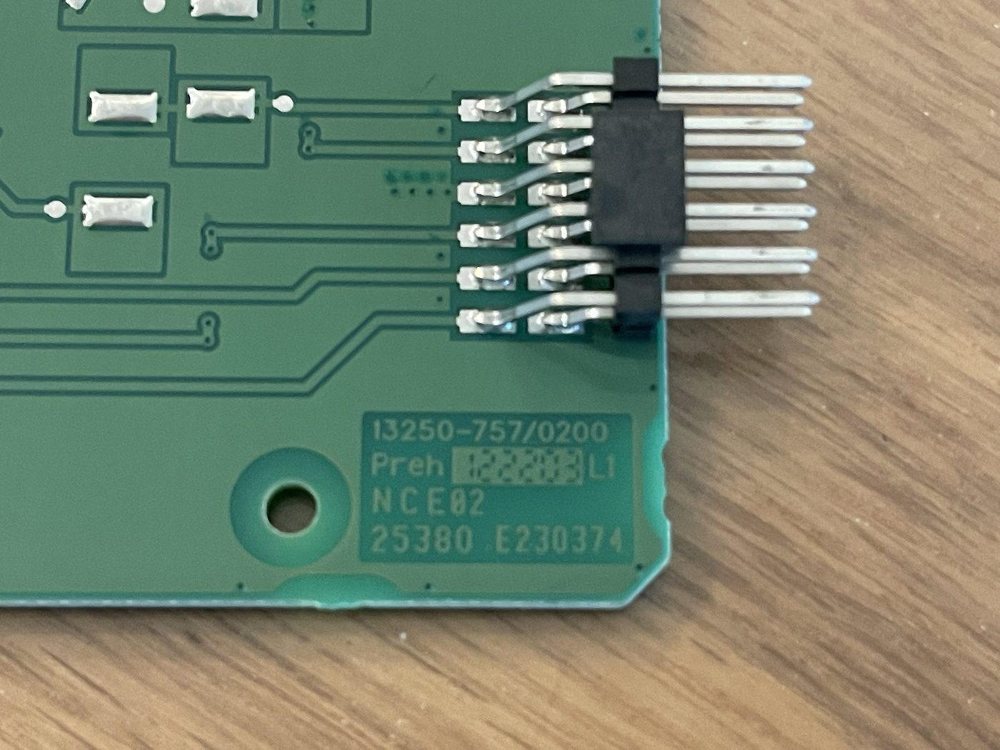
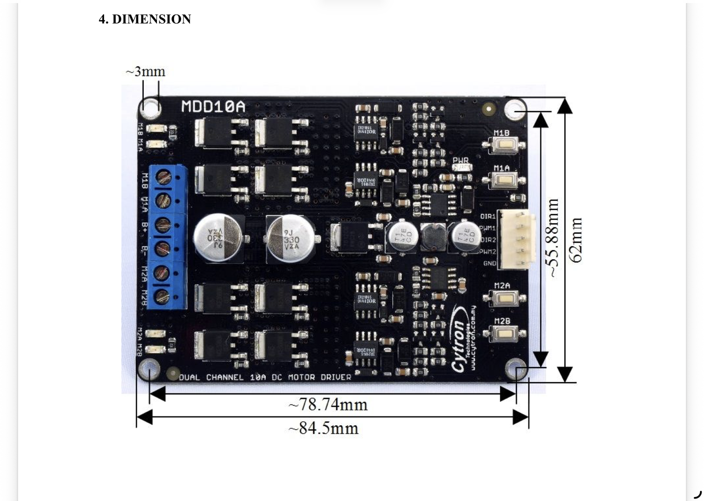
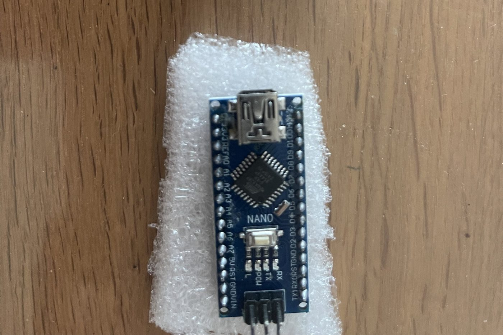
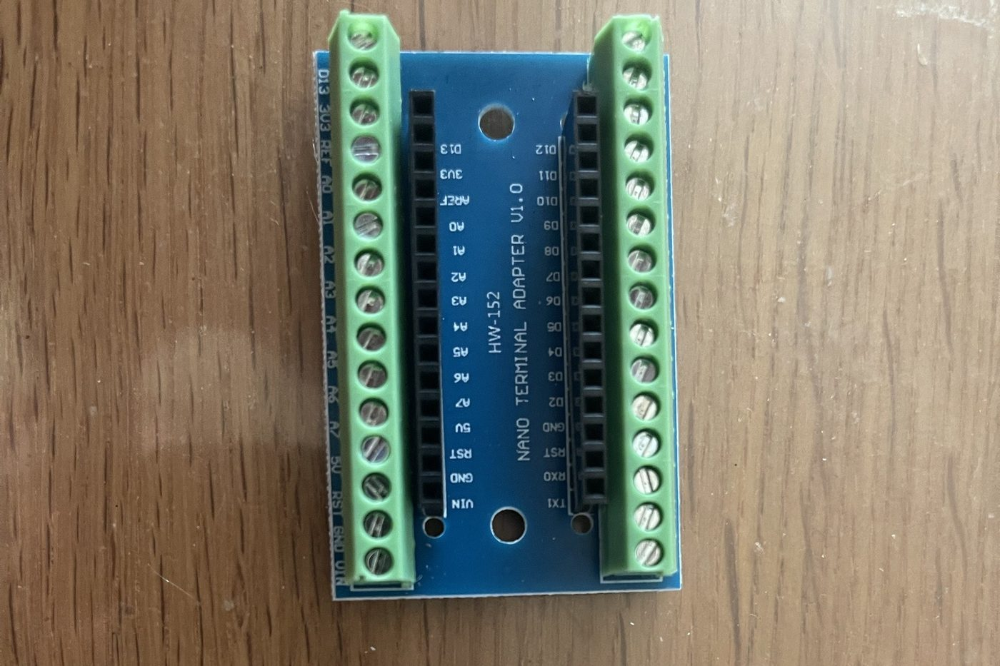
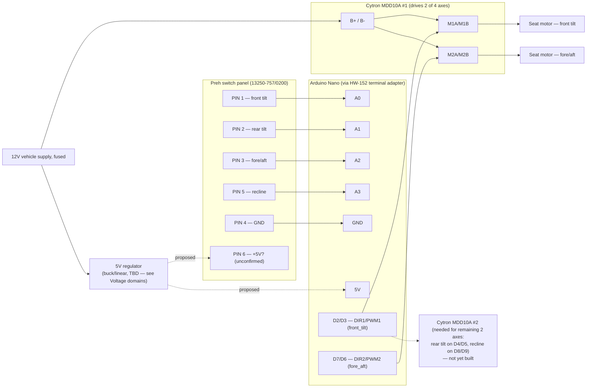

# Audi Q8 Seat Control Reverse-Engineering Project

Repurposing an Audi 4N095747D switch assembly (Preh 13250-757/0200) as a standalone control
interface for 12V seat motors in a different vehicle. This document tracks what's been measured
on the OEM hardware so far, the wiring scheme inferred from it, and what's still open before any
12V motor is connected.

> **Status:** reverse-engineering in progress. The wiring scheme below is an interpretation of the
> photographed hardware, not yet confirmed end-to-end with a multimeter — treat resistor values and
> PIN 6's function as working hypotheses until verified.

## Voltage domains

This system has two electrically separate voltage domains that must never be tied together
directly:

| Domain | Voltage | Covers |
|---|---|---|
| **Motor power** | 12V (vehicle supply) | Cytron `B+`/`B-` terminals → seat motors only |
| **Logic** | 5V | Nano, its ADC reference, and (per the PIN 6 hypothesis) the switch panel's pull-up supply |

The car is a 12V system, but the Nano and the switch panel's signal lines are **not** — the Nano's
ADC reads 0–1023 against a 5V reference, and the confirmed PIN 1 idle reading of ~1023 only makes
sense if the pull-up feeding that line is ~5V. Feeding 12V into a Nano analog/digital pin or into
the switch panel's signal lines directly will exceed the pin's rating and damage it. The 5V rail is
**derived from the 12V supply through a regulator** (see [Logic
supply](#vehicle-integration-checklist) below) — it isn't a separate source you wire in
independently.

## Hardware inventory

| Component | Part / model | Role |
|---|---|---|
| Seat switch panel | Preh `13250-757/0200`, marking `NCE02` | OEM Audi switch cluster — passive input device, 12-position connector |
| Mating connector | TE Connectivity `1534096-1` / `1-1534096-1`, 12-cavity — [sourced from AliExpress](https://www.aliexpress.com/item/1005004665778565.html), pre-wired pigtail | Plugs into the switch panel; wires already terminated, ready to connect to the Nano — see caveat below |
| Motor driver | Cytron MDD10A | Dual-channel 10A H-bridge DC motor driver |
| Motor driver control cable | KF2510 2.54mm 5-pin pre-crimped cable, 20cm, 26AWG — sourced from eBay (listing: "KF2510 2.54mm Connectors & Wire Cable 2 3 4 5 6 Pin 20cm 26AWG UK SELLER", seller Electronic-Workshop) | Mates with the MDD10A's `DIR1/PWM1/DIR2/PWM2/GND` control header; bought as a 2-pack, covering both this board and the second one still to be sourced |
| Microcontroller | Arduino Nano (ATmega328) | Reads switch panel, drives motor controller |
| Breakout | HW-152 "Nano Terminal Adapter V1.0" | Screw-terminal breakout for the Nano's header pins |

### Switch panel



*Full switch panel (back side). Eight tactile switches are visible, wired through two repeated SMD
resistor values (silkscreened `8200` and `3920` — read as 820 Ω and 392 Ω using the standard
3-digit + multiplier code, unverified against a multimeter). Eight switches across four movement
axes lines up with two buttons (one per direction) per axis, each routed through a different
resistor — see [Inferred signal encoding](#inferred-signal-encoding) below.*



*Close-up of the panel's output connector, part marking `13250-757/0200 Preh NCE02 25380.E230374`.
The panel's case takes a 12-position mating connector (TE Connectivity `1534096-1` /
`1-1534096-1`) — only 6 of those 12 cavities have been identified as functional so far (see
[Confirmed control mapping](#confirmed-control-mapping)); the other 6 are unaccounted for, not
confirmed empty.*

> **Sourcing note:** that TE part number is what online listings sell as a match, cross-referenced
> against VW `8E0972112A` and described there as a "radar" harness connector — i.e. it's being sold
> as a generic shell reused across several VAG harnesses, not something listed specifically for this
> seat switch. A pre-wired pigtail version has been bought and physically mates with the panel,
> which confirms cavity count/pitch/keying are correct — what's still unconfirmed is which of the
> pigtail's 12 wires correspond to which of the panel's cavities (see below).

**Open item:** the pigtail presumably brings out all 12 wires, most likely colour-coded or otherwise
distinguishable per cavity — but that mapping (wire colour/position → cavity number → the PIN 1–6
functions already identified) hasn't been recorded here yet. Trace each wire from the connector back
to its cavity before wiring anything to the Nano, and don't rely on wire colour alone matching a
generic pinout found online, since this connector is sold as a shared shell across multiple VAG
applications.

### Motor driver



*Cytron MDD10A dual-channel 10A DC motor driver. Terminal block: `M1B / M1A / B+ / B- / M2A / M2B`.
Control header: `DIR1 / PWM1 / DIR2 / PWM2 / GND` — a standard 2.54mm 5-position connector, matched
by the KF2510 pigtail in the [hardware inventory](#hardware-inventory) above. This board only
drives two motors — see [Next Steps](#next-steps) for the implication on a 4-axis seat.*

**Open item:** the KF2510 pigtail's 5 wires need to be traced to their connector positions (1–5)
and matched against the board's `DIR1/PWM1/DIR2/PWM2/GND` silkscreen before connecting to the
Nano — don't assume a fixed wire-colour order, since KF2510 is a generic 2.54mm standard, not
something Cytron-specific.

### Controller




*Arduino Nano and the HW-152 screw-terminal adapter used to break out its header pins for
solderless wiring to the switch panel and motor driver.*

## Key Findings

The switch PCB functions as a passive input device rather than a motor controller. Directional
information is encoded through resistance networks, not separate connector pins. The Arduino
successfully decoded PIN 1 signals (10-bit ADC, 0–1023):

| State | ADC reading |
|---|---|
| Neutral (no button pressed) | ~1023 |
| Downward adjustment | ~27–28 |
| Upward adjustment | ~40–41 |

The large gap between neutral (~1023, i.e. pulled high) and either pressed state (~27–41, pulled
sharply low) indicates a pull-up on the line with a low-value resistor switched in to ground on
each button press — different resistors per direction, which is exactly the two repeated SMD
values (820 Ω / 392 Ω) visible on the panel.

## Confirmed control mapping

| Pin | Function | Status |
|---|---|---|
| PIN 1 | Front seat-base tilt | Confirmed (ADC values above) |
| PIN 2 | Rear seat-base tilt | Identified, ADC values not yet measured |
| PIN 3 | Entire seat forward/backward movement | Identified, ADC values not yet measured |
| PIN 4 | Common reference (ground) | Confirmed |
| PIN 5 | Backrest recline adjustment | Identified, ADC values not yet measured |
| PIN 6 | Unknown | **Hypothesis:** shared +5V (logic domain, *not* 12V — see [Voltage domains](#voltage-domains)) pull-up supply for the four resistor-ladder inputs — not yet measured |

The panel's mating connector has 12 cavities (see [hardware inventory](#hardware-inventory)); PINs
1–6 above are the ones identified so far. The remaining 6 cavities haven't been probed — they may
be unused on this panel variant, reserved for other functions (e.g. lumbar, memory buttons) present
on related Preh panels but not populated here, or something else entirely. Don't assume they're
empty until checked.

## Inferred signal encoding

Working theory for how each axis line behaves, based on the eight switches and two resistor values
on the panel plus the PIN 1 readings above. This is inferred from photos, not confirmed by
continuity testing — verify with a multimeter before relying on it:

```
                 PIN 6 (+5V?, proposed pull-up supply)
                         |
                    [pull-up resistor, value TBD]
                         |
Nano ADC pin  <----------+----------  e.g. PIN 1 (front tilt)
                         |
              +----------+----------+
              |                     |
         [~820R]                [~392R]
        "down" resistor       "up" resistor
              |                     |
          SW down                SW up
              |                     |
              +----------+----------+
                         |
                 PIN 4 (GND, common return)
```

Each of the four movement pins (1, 2, 3, 5) is expected to follow this same pattern: idle high
(~1023), pulled to a low-but-distinct ADC value depending on which of the two direction buttons for
that axis is pressed. That matches the panel having 8 switches for 4 axes (2 directions each), and
the two SMD resistor values repeating across the board.

## Proposed system wiring

End-to-end signal path from switch panel to motors, based on the parts in the [hardware
inventory](#hardware-inventory). Only PIN 1's behavior is empirically confirmed; the rest of this
diagram is a proposed build, not a verified one.



Note only two of the four confirmed movement axes can be driven per MDD10A board — a second driver
board is needed to cover all four (see Next Steps). The 12V supply only ever reaches the `B+`/`B-`
motor terminals; everything else (switch panel, Nano, ADC lines) runs on the 5V rail produced by
the regulator, per [Voltage domains](#voltage-domains).

## Firmware

| Sketch | Purpose |
|---|---|
| [`firmware/diagnostic_read_switch_panel`](firmware/diagnostic_read_switch_panel/diagnostic_read_switch_panel.ino) | Prints raw ADC values for all four movement pins over serial. Use this to fill in the still-missing PIN 2/3/5 measurements and to sanity-check the PIN 6 hypothesis. |
| [`firmware/seat_control_main`](firmware/seat_control_main/seat_control_main.ino) | Draft control loop: reads all four axes, drives the Cytron board(s), and stops a motor if it's held on past an 8-second safety cutoff. Thresholds are copied from the PIN 1 measurement and are placeholders for the other three axes until measured. |

Neither sketch has been run against real hardware yet — the diagnostic sketch is the next thing to
flash once PIN 6 is wired up per the hypothesis above.

## Vehicle integration checklist

Not started. Before any of this touches a vehicle:

- **Power source** — decide whether the controller runs off a fused, switched 12V feed (so it's
  dead with the ignition off) or a permanent feed with its own switching. Either way, fuse it at
  the source, not just at the driver board.
- **Logic supply** — the Nano and the switch panel's PIN 6 need a regulated 5V derived from the
  12V rail, not 12V itself. Two safe options: (a) feed 12V into the Nano's `VIN` pin — its onboard
  regulator accepts 7–12V and produces 5V for the board (the `5V` pin becomes an output in this
  case, and the switch panel's PIN 6 could tap it if the resistor-ladder's current draw is small,
  which it should be); or (b) use a separate 12V→5V buck converter (more efficient than the Nano's
  linear regulator if driving extra load) and feed its regulated output into the Nano's `5V` pin
  directly. **Never connect 12V straight to the Nano's `5V` pin** — that pin bypasses the onboard
  regulator entirely and will destroy the board. Confirm from the MDD10A datasheet whether it
  already has an onboard 5V logic output before adding a separate regulator.
- **Common ground** — switch panel PIN 4, Nano GND, both Cytron boards' GND, and the 12V supply
  return all need to share one reference; a floating or high-resistance ground will show up as
  garbage ADC readings on the switch panel lines before it shows up anywhere else.
- **Target motor ratings** — get the stall current and connector type for the seat motors in the
  destination vehicle. The MDD10A is rated 10A/channel continuous; confirm the motors' stall
  current stays under that with margin, and size wiring/fuses to the stall figure, not the running
  figure.
- ~~**Connector matching**~~ — done: pre-wired pigtail (TE `1534096-1` / `1-1534096-1`) bought and
  confirmed to mate with the panel. Still open: trace and record which of its 12 wires land on
  which cavity, per the note under [Switch panel](#switch-panel).
- **Enclosure** — the Nano, both driver boards, and the wiring need protection from vibration and
  moisture once installed; this hasn't been designed yet.

## Next Steps

- Flash `diagnostic_read_switch_panel` and measure PINs 2, 3, and 5 (same neutral/up/down method
  used for PIN 1), and check whether tying PIN 6 to 5V is actually needed for sane readings.
- Confirm the two SMD resistor values (silkscreened `8200` / `3920`) by direct measurement rather
  than reading the printed code from photos.
- Probe the 6 unaccounted-for cavities on the 12-position connector — confirm whether they're
  genuinely unused or carry signals not yet identified.
- Trace the pigtail's 12 wires back to their cavities and record the mapping in this README —
  needed before wiring the pigtail to the Nano.
- Trace the KF2510 cable's 5 wires to their connector positions and match against
  `DIR1/PWM1/DIR2/PWM2/GND` before wiring it to the Nano.
- Update the placeholder thresholds in `seat_control_main` once real PIN 2/3/5 values are in.
- Source a second Cytron MDD10A (or equivalent dual H-bridge) — one board only covers 2 of the 4
  seat motors.
- Work through the [vehicle integration checklist](#vehicle-integration-checklist) above — power,
  grounding, target motor ratings, connectors, enclosure — before connecting any seat motor. Do not
  wire B+/B- to a vehicle 12V supply until that's done.
