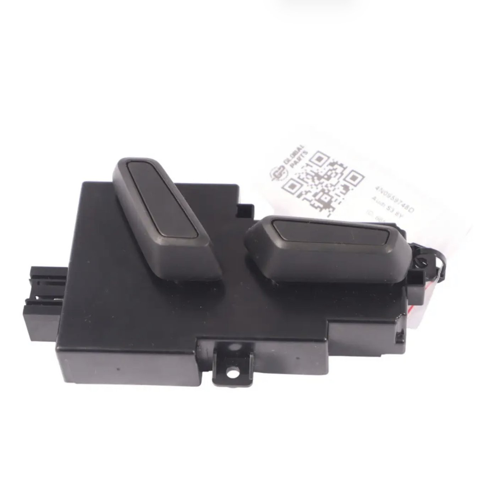
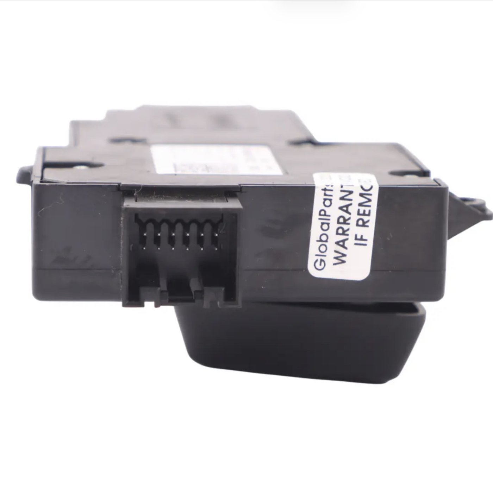
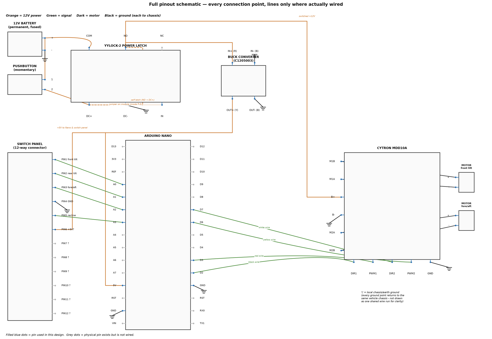
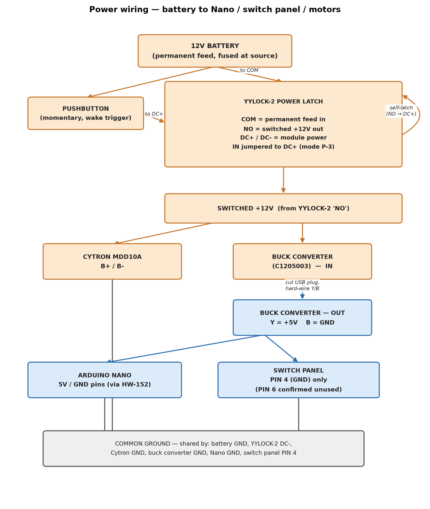
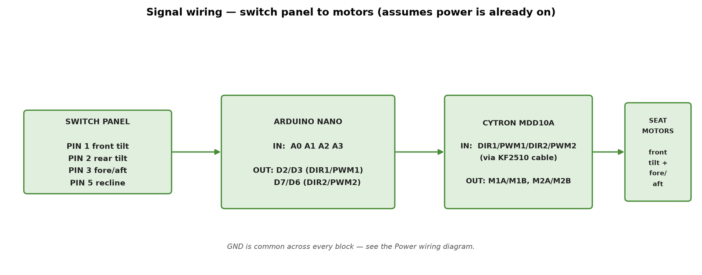
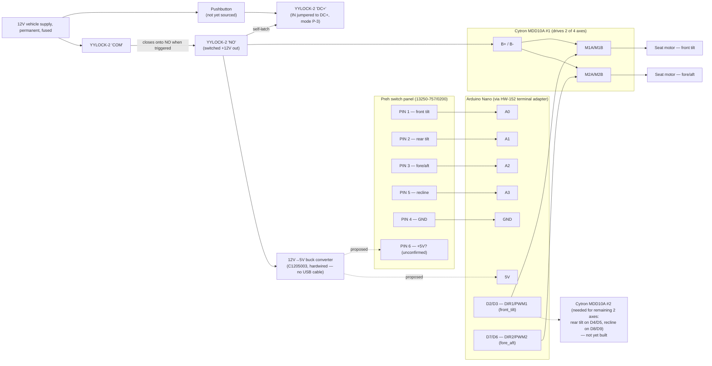

# Audi Q8 Seat Control Reverse-Engineering Project

Repurposing an Audi `4N0959748D` switch assembly (Preh `13250-757/0200`) as a standalone control
interface for 12V seat motors in a different vehicle. This document tracks what's been measured
on the OEM hardware so far, the wiring scheme inferred from it, and what's still open before any
12V motor is connected.

> **Status:** reverse-engineering in progress. The wiring scheme below is an interpretation of the
> photographed hardware, not yet confirmed end-to-end with a multimeter — treat resistor values and
> PIN 6's function as working hypotheses until verified.

## Voltage domains

This system has two electrically separate voltage domains that must never be tied together
directly:

| Domain | Voltage | Covers |
|---|---|---|
| **Motor power** | 12V (vehicle supply) | Cytron `B+`/`B-` terminals → seat motors only |
| **Logic** | 5V | Nano, its ADC reference, and (per the PIN 6 hypothesis) the switch panel's pull-up supply |

The car is a 12V system, but the Nano and the switch panel's signal lines are **not** — the Nano's
ADC reads 0–1023 against a 5V reference, and the confirmed PIN 1 idle reading of ~1023 only makes
sense if the pull-up feeding that line is ~5V. Feeding 12V into a Nano analog/digital pin or into
the switch panel's signal lines directly will exceed the pin's rating and damage it. The 5V rail is
**derived from the 12V supply through a buck converter** (module marked `C1205003` — see [Logic
supply](#vehicle-integration-checklist) below) — it isn't a separate source you wire in
independently.

## Hardware inventory

| Component | Part / model | Role |
|---|---|---|
| Seat switch panel | Audi `4N0959748D`, PCB marked Preh `13250-757/0200` / `NCE02` — also cross-referenced by resellers to Audi S3 (8Y) | OEM Audi switch cluster — passive input device, 12-position connector |
| Mating connector | TE Connectivity `1534096-1` / `1-1534096-1`, 12-cavity — [sourced from AliExpress](https://www.aliexpress.com/item/1005004665778565.html), pre-wired pigtail | Plugs into the switch panel; wires already terminated, ready to connect to the Nano — see caveat below |
| Motor driver | Cytron MDD10A | Dual-channel 10A H-bridge DC motor driver |
| Motor driver control cable | KF2510 2.54mm 5-pin pre-crimped cable, 20cm, 26AWG — sourced from eBay (listing: "KF2510 2.54mm Connectors & Wire Cable 2 3 4 5 6 Pin 20cm 26AWG UK SELLER", seller Electronic-Workshop) | Connectorised end mates with the MDD10A's `DIR1/PWM1/DIR2/PWM2/GND` header; the other end is bare flying leads that land on the Nano (via the HW-152 terminal adapter). Bought as a 2-pack, covering both this board and the second one still to be sourced |
| Microcontroller | Arduino Nano (ATmega328) | Reads switch panel, drives motor controller |
| Breakout | HW-152 "Nano Terminal Adapter V1.0" | Screw-terminal breakout for the Nano's header pins |
| Logic supply regulator | 12V→5V buck converter, module marked `C1205003`, 15W, 5V/3A max output | Steps the constant 12V feed down to 5V for the Nano and switch panel; see [Logic supply](#vehicle-integration-checklist) for the recommended wiring — bypass the pre-attached micro-USB cable |
| Power latch module | Garosa YYLOCK-2 (or equivalent) self-locking delay-relay module, `SLA-12VDC-SL-C` relay, 30A/250VAC or 30A/30VDC at the module level, delay 0s–100min — not yet sourced | Pushbutton-powered, self-latching wake/auto-off controller; its relay contacts also carry the actual switched load (Cytron `B+` + buck converter) — see [Power latch](#power-latch) |
| Power latch pushbutton | Momentary, normally-open pushbutton — not yet sourced | User-facing wake trigger, dash or seat-mounted; draws zero current when not pressed |

### Switch panel



*Assembled unit as removed from the seat, part label `4N0959748D` / "Audi S3 8Y" visible. Two large
rocker paddles are what the user actually presses — not the eight individual tactile switches seen
on the bare PCB below. Each paddle rocks on 4 corners, each corner pressing a different underlying
switch: 2 paddles × 4 corners = the 8 switches already documented, and lines up exactly with 4
axes × 2 directions each. This is a standard mechanical pattern for this style of OEM seat switch.*



*The mating connector is molded directly into the housing — this is the physical point the TE
pigtail (below) plugs into.*


*Full switch panel (back side). Eight tactile switches are visible, wired through two repeated SMD
resistor values (silkscreened `8200` and `3920` — read as 820 Ω and 392 Ω using the standard
3-digit + multiplier code, unverified against a multimeter). Eight switches across four movement
axes lines up with two buttons (one per direction) per axis, each routed through a different
resistor — see [Inferred signal encoding](#inferred-signal-encoding) below.*


*Close-up of the panel's output connector, part marking `13250-757/0200 Preh NCE02 25380.E230374`.
The panel's case takes a 12-position mating connector (TE Connectivity `1534096-1` /
`1-1534096-1`) — only 6 of those 12 cavities have been identified as functional so far (see
[Confirmed control mapping](#confirmed-control-mapping)); the other 6 are unaccounted for, not
confirmed empty.*

> **Sourcing note:** that TE part number is what online listings sell as a match, cross-referenced
> against VW `8E0972112A` and described there as a "radar" harness connector — i.e. it's being sold
> as a generic shell reused across several VAG harnesses, not something listed specifically for this
> seat switch. A pre-wired pigtail version has been bought and physically mates with the panel,
> which confirms cavity count/pitch/keying are correct — what's still unconfirmed is which of the
> pigtail's 12 wires correspond to which of the panel's cavities (see below).

**Open item:** the pigtail presumably brings out all 12 wires, most likely colour-coded or otherwise
distinguishable per cavity — but that mapping (wire colour/position → cavity number → the PIN 1–6
functions already identified) hasn't been recorded here yet. Trace each wire from the connector back
to its cavity before wiring anything to the Nano, and don't rely on wire colour alone matching a
generic pinout found online, since this connector is sold as a shared shell across multiple VAG
applications.

### Motor driver


*Cytron MDD10A dual-channel 10A DC motor driver. Terminal block: `M1B / M1A / B+ / B- / M2A / M2B`.
Control header: `DIR1 / PWM1 / DIR2 / PWM2 / GND` — a standard 2.54mm 5-position connector, matched
by the KF2510 pigtail in the [hardware inventory](#hardware-inventory) above. This board only
drives two motors — see [Next Steps](#next-steps) for the implication on a 4-axis seat.*

**Open item:** the KF2510 cable's connectorised end plugs straight into the MDD10A header, but the
5 bare leads on the other end still need to be identified by continuity back to connector position
(1–5) and matched against `DIR1/PWM1/DIR2/PWM2/GND` — then landed on the correct Nano pins via the
HW-152 terminal adapter, matching the assignment in
[`seat_control_main.ino`](firmware/seat_control_main/seat_control_main.ino) (front_tilt: D2=DIR1,
D3=PWM1; fore_aft: D7=DIR2, D6=PWM2). Don't assume a fixed wire-colour order — KF2510 is a generic
2.54mm standard, not something Cytron-specific.

### Controller


*Arduino Nano and the HW-152 screw-terminal adapter used to break out its header pins for
solderless wiring to the switch panel and motor driver.*

## Key Findings

The switch PCB functions as a passive input device rather than a motor controller. Directional
information is encoded through resistance networks, not separate connector pins. The Arduino
successfully decoded PIN 1 signals (10-bit ADC, 0–1023):

| State | ADC reading |
|---|---|
| Neutral (no button pressed) | ~1023 |
| Downward adjustment | ~27–28 |
| Upward adjustment | ~40–41 |

The large gap between neutral (~1023, i.e. pulled high) and either pressed state (~27–41, pulled
sharply low) indicates a pull-up on the line with a low-value resistor switched in to ground on
each button press — different resistors per direction, which is exactly the two repeated SMD
values (820 Ω / 392 Ω) visible on the panel.

## Confirmed control mapping

| Pin | Function | Status |
|---|---|---|
| PIN 1 | Front seat-base tilt | Confirmed (ADC values above) |
| PIN 2 | Rear seat-base tilt | Identified, ADC values not yet measured |
| PIN 3 | Entire seat forward/backward movement | Identified, ADC values not yet measured |
| PIN 4 | Common reference (ground) | Confirmed |
| PIN 5 | Backrest recline adjustment | Identified, ADC values not yet measured |
| PIN 6 | Unknown | **Hypothesis:** shared +5V (logic domain, *not* 12V — see [Voltage domains](#voltage-domains)) pull-up supply for the four resistor-ladder inputs — not yet measured |

The panel's mating connector has 12 cavities (see [hardware inventory](#hardware-inventory)); PINs
1–6 above are the ones identified so far. The remaining 6 cavities haven't been probed — they may
be unused on this panel variant, reserved for other functions (e.g. lumbar, memory buttons) present
on related Preh panels but not populated here, or something else entirely. Don't assume they're
empty until checked.

## Inferred signal encoding

Working theory for how each axis line behaves, based on the eight switches and two resistor values
on the panel plus the PIN 1 readings above. This is inferred from photos, not confirmed by
continuity testing — verify with a multimeter before relying on it:

```
                 PIN 6 (+5V?, proposed pull-up supply)
                         |
                    [pull-up resistor, value TBD]
                         |
Nano ADC pin  <----------+----------  e.g. PIN 1 (front tilt)
                         |
              +----------+----------+
              |                     |
         [~820R]                [~392R]
        "down" resistor       "up" resistor
              |                     |
          SW down                SW up
              |                     |
              +----------+----------+
                         |
                 PIN 4 (GND, common return)
```

Each of the four movement pins (1, 2, 3, 5) is expected to follow this same pattern: idle high
(~1023), pulled to a low-but-distinct ADC value depending on which of the two direction buttons for
that axis is pressed. That matches the panel having 8 switches for 4 axes (2 directions each), and
the two SMD resistor values repeating across the board — and now that the assembled unit's been
seen (see [Switch panel](#switch-panel)), it also matches the physical layout exactly: 2 external
rocker paddles, each a 4-corner rocker, giving 2 × 4 = 8 underlying switches.

## Proposed system wiring

End-to-end wiring from battery to motors, based on the parts in the [hardware
inventory](#hardware-inventory). Only PIN 1's behavior is empirically confirmed; the rest of this
is a proposed build, not a verified one.



*Every connection point on every component, drawn like a circuit board view — filled blue dots are
pins actually wired in this design; grey dots are real pins on the part that are simply unused
(e.g. the switch panel's 6 unidentified cavities, the YYLOCK-2's `NC` contact, most of the Nano's
pins). Orange = 12V power, green = signal, dark = motor output. Each `▽` is a local chassis/earth
ground symbol — every ground point (battery, YYLOCK-2, buck converter, Nano ×2, Cytron ×2, switch
panel PIN 4) returns to the same vehicle chassis; they're drawn as separate local symbols rather
than one wire run joining them all, since in the car they don't share a physical wire back to a
single point anyway. The Nano↔Cytron control cable's real wire colours are labelled on those four
signal lines (black/red/yellow/white) — confirmed from the physical KF2510 cable; only the Nano end
has been traced so far, so double-check the same colours land on Cytron's `DIR1/PWM1/PWM2/DIR2`
silkscreen before trusting it fully.*

For a lower-detail overview, the same system split into just power and signal flow:





A pin-level Mermaid version of the same system, for reference:



Note only two of the four confirmed movement axes can be driven per MDD10A board — a second driver
board is needed to cover all four (see Next Steps). The 12V supply only ever reaches the `B+`/`B-`
motor terminals; everything else (switch panel, Nano, ADC lines) runs on the 5V rail produced by
the regulator, per [Voltage domains](#voltage-domains).

## Power latch

The controller needs to work with the ignition off (so seat position can be adjusted before
getting in), but the whole point is that it must **not** sit drawing current 24/7 off the permanent
12V feed — that's how you come back to a dead battery. Solution: a single self-locking delay-relay
module (Garosa YYLOCK-2 or equivalent: `SLA-12VDC-SL-C` relay, 30A/250VAC or 30A/30VDC rated at the
module level — not just the bare relay chip, terminals sized to match) whose own power input, not
just a signal pin, is gated by a pushbutton. At rest, nothing downstream has any power at all.

```
+12V permanent (fused) ----+------------------------------------+
                            |                                    |
                      [pushbutton]                          YYLOCK "COM"
                      (momentary)                        (permanent feed in)
                            |                                    |
                            +--------------+          closes onto "NO" when
                                           |            the relay is energized
                                     YYLOCK "DC+" <----------- YYLOCK "NO"
                                           |               (switched +12V out)
                                     YYLOCK "IN" (jumpered to DC+
                                     on the module itself — mode P-3)
                                           |
                                     YYLOCK "DC-" ---> common GND

switched +12V (from "NO") ---> Cytron B+ and buck converter IN (both fed from here)
```

- **Wake:** pressing the pushbutton applies 12V to the module's `DC+`/`DC-`. Because `IN` is
  permanently jumpered to `DC+`, the module sees itself as already triggered the instant it powers
  up — no separate trigger wiring needed.
- **Mode P-3** ("Timed Output Mode"), per the module's manual: *"if the input is continuously
  shorted, the relay activates for the set delay period and then deactivates until power is
  removed."* That's the whole behavior in one sentence — relay closes immediately, stays closed for
  a delay set via the `SET` button (aim for 10–15 minutes), then opens and stays open until power
  is fully cycled again.
- **Self-latch and load, same contact:** the relay's `NO`/`COM` pair is wired back to `DC+` in
  parallel with the pushbutton (so releasing the button changes nothing — the module now holds its
  own power on) **and** feeds the buck converter + Cytron `B+` downstream. One 30A-rated contact
  pair does both jobs — no separate main relay needed, unlike the two-stage design this replaces.
- **Auto-off:** when the set delay elapses, the relay opens, cutting its own power and the
  downstream load together — including the Nano. At rest, the pushbutton is open and the module has
  no power on it: draw is genuinely zero.
- **No firmware role:** `seat_control_main.ino` has no power-management code — the module handles
  wake and timeout entirely on its own hardware.

Other modes exist (`P-1` self-locking/toggle, `P-2` power-off delay, `P-4` delayed-on) but none fit
this use case — see the module's manual for the full function list if reconsidering.

**Open items:**
1. Bench-test the module standalone (module + pushbutton + multimeter, nothing else attached):
   confirm `P-3` with `IN` shorted to `DC+` behaves as documented, and confirm the module actually
   retains its configured mode/delay across a full power cycle — it's advertised to ("permanent
   memory mode when power is off"), which matters more here than in a normally-always-powered
   application, since this module's own power is cut every single time it goes to sleep by design.
2. Confirm real-world current handling under a load similar to actual motor stall current before
   trusting the 30A rating for good — the module-level rating is more credible than a bare relay
   chip's printed number, but hasn't been independently verified here.

## Firmware

| Sketch | Purpose |
|---|---|
| [`firmware/diagnostic_read_switch_panel`](firmware/diagnostic_read_switch_panel/diagnostic_read_switch_panel.ino) | Prints raw ADC values for all four movement pins over serial. Use this to fill in the still-missing PIN 2/3/5 measurements and to sanity-check the PIN 6 hypothesis. |
| [`firmware/seat_control_main`](firmware/seat_control_main/seat_control_main.ino) | Draft control loop: reads all four axes, drives the Cytron board(s), and stops a motor if it's held on past an 8-second safety cutoff. Has no role in power management — the [power latch](#power-latch) handles wake/auto-off entirely in hardware. Thresholds are copied from the PIN 1 measurement and are placeholders for the other three axes until measured. |

Neither sketch has been run against real hardware yet — the diagnostic sketch is the next thing to
flash once PIN 6 is wired up per the hypothesis above.

## Vehicle integration checklist

Not started. Before any of this touches a vehicle:

- **Power source** — decided: a permanent 12V feed straight from the battery, fused at the battery
  end and sized to the sum of what's downstream. Seat adjustment needs to work with the ignition
  off, which rules out simply gating this off an ignition-switched circuit — instead the feed goes
  through the [power latch](#power-latch) relay, so the controller draws no standby current between
  uses despite being fed from a permanent source.
- **Logic supply** — sourced: a 12V→5V buck converter (module marked `C1205003`, 15W, rated 5V/3A
  output — comfortably more than the Nano plus the switch panel's PIN 6 pull-up will ever draw). It
  comes with a pre-attached micro-USB cable meant for powering the Nano through its USB port — for
  a permanent vehicle install, **don't use that USB connection**. A USB plug isn't rated for
  continuous vibration and is one more failure point with no benefit here. Instead: cut off (or
  ignore) the micro-USB plug, and wire the module's `Y` (yellow, +5V out) and `B` (black, GND out)
  leads directly into the Nano's `5V` and `GND` pins via the HW-152 terminal adapter you already
  have. Fuse the module's `R` (red, 12V in) lead separately from the motor supply fuse — 1A is
  ample headroom for what this rail actually powers. **Never connect 12V straight to the Nano's
  `5V` pin** — only the module's regulated 5V *output* goes there; the module's 12V *input* side is
  a completely separate pair of wires. Confirm from the MDD10A datasheet whether it already has an
  onboard 5V logic output before assuming you need this converter for anything beyond the Nano.
- **Common ground** — switch panel PIN 4, Nano GND, both Cytron boards' GND, and the 12V supply
  return all need to share one reference; a floating or high-resistance ground will show up as
  garbage ADC readings on the switch panel lines before it shows up anywhere else.
- **Target motor ratings** — get the stall current and connector type for the seat motors in the
  destination vehicle. The MDD10A is rated 10A/channel continuous; confirm the motors' stall
  current stays under that with margin, and size wiring/fuses to the stall figure, not the running
  figure.
- ~~**Connector matching**~~ — done: pre-wired pigtail (TE `1534096-1` / `1-1534096-1`) bought and
  confirmed to mate with the panel. Still open: trace and record which of its 12 wires land on
  which cavity, per the note under [Switch panel](#switch-panel).
- **Enclosure** — the Nano, both driver boards, and the wiring need protection from vibration and
  moisture once installed; this hasn't been designed yet.

## Next Steps

- Flash `diagnostic_read_switch_panel` and measure PINs 2, 3, and 5 (same neutral/up/down method
  used for PIN 1), and check whether tying PIN 6 to 5V is actually needed for sane readings.
- Confirm the two SMD resistor values (silkscreened `8200` / `3920`) by direct measurement rather
  than reading the printed code from photos.
- Probe the 6 unaccounted-for cavities on the 12-position connector — confirm whether they're
  genuinely unused or carry signals not yet identified.
- Trace the pigtail's 12 wires back to their cavities and record the mapping in this README —
  needed before wiring the pigtail to the Nano.
- Nano-side landing of the KF2510 cable is done: `GND`→orange, `D2`→black, `D3`→red, `D6`→yellow,
  `D7`→white (see [Proposed system wiring](#proposed-system-wiring)). Still need to confirm the
  same colours land on Cytron's `DIR1/PWM1/PWM2/DIR2/GND` silkscreen on the other end.
- Update the placeholder thresholds in `seat_control_main` once real PIN 2/3/5 values are in.
- Source a second Cytron MDD10A (or equivalent dual H-bridge) — one board only covers 2 of the 4
  seat motors.
- Cut off the buck converter's micro-USB plug and wire its `Y`/`B` output leads directly to the
  Nano's `5V`/`GND` pins via the HW-152 adapter; fuse its `R` (12V in) lead separately from the
  motor supply fuse, even though both now come from the same switched output.
- Source the YYLOCK-2 (or equivalent) module and a momentary pushbutton.
- Bench-test the power latch on its own (module + pushbutton, no Nano/buck converter/Cytron
  attached yet) — confirm mode `P-3` with `IN` shorted to `DC+` behaves as documented, confirm
  settings survive a full power cycle, and confirm it draws nothing at rest — before it's gating
  anything that matters.
- Decide on and mount the pushbutton location (dashboard vs. seat).
- Work through the [vehicle integration checklist](#vehicle-integration-checklist) above — power,
  grounding, target motor ratings, connectors, enclosure — before connecting any seat motor. Do not
  wire B+/B- to a vehicle 12V supply until that's done.
