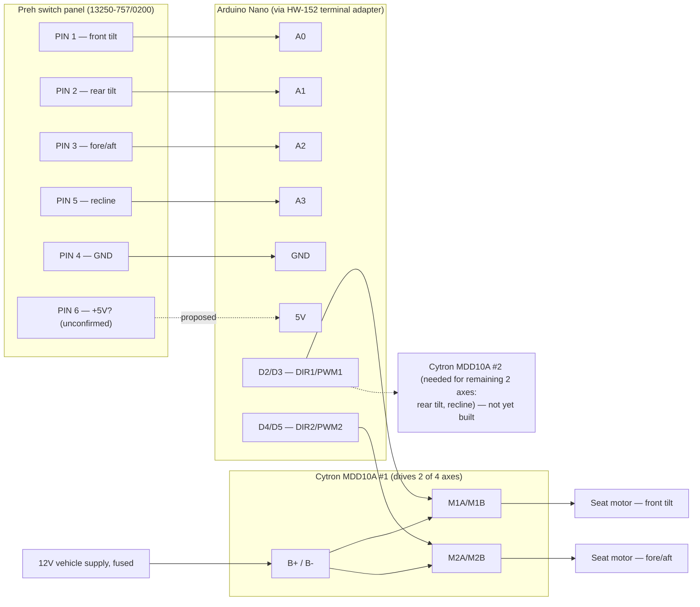

# Audi Q8 Seat Control Reverse-Engineering Project

Repurposing an Audi 4N095747D switch assembly (Preh 13250-757/0200) as a standalone control
interface for 12V seat motors in a different vehicle. This document tracks what's been measured
on the OEM hardware so far, the wiring scheme inferred from it, and what's still open before any
12V motor is connected.

> **Status:** reverse-engineering in progress. The wiring scheme below is an interpretation of the
> photographed hardware, not yet confirmed end-to-end with a multimeter — treat resistor values and
> PIN 6's function as working hypotheses until verified.

## Hardware inventory

| Component | Part / model | Role |
|---|---|---|
| Seat switch panel | Preh `13250-757/0200`, marking `NCE02` | OEM Audi switch cluster — passive input device, 6-pin connector |
| Motor driver | Cytron MDD10A | Dual-channel 10A H-bridge DC motor driver |
| Microcontroller | Arduino Nano (ATmega328) | Reads switch panel, drives motor controller |
| Breakout | HW-152 "Nano Terminal Adapter V1.0" | Screw-terminal breakout for the Nano's header pins |

### Switch panel


*Full switch panel (back side). Eight tactile switches are visible, wired through two repeated SMD
resistor values (silkscreened `8200` and `3920` — read as 820 Ω and 392 Ω using the standard
3-digit + multiplier code, unverified against a multimeter). Eight switches across four movement
axes lines up with two buttons (one per direction) per axis, each routed through a different
resistor — see [Inferred signal encoding](#inferred-signal-encoding) below.*


*Close-up of the 6-pin output connector, part marking `13250-757/0200 Preh NCE02 25380.E230374`.*

### Motor driver


*Cytron MDD10A dual-channel 10A DC motor driver. Terminal block: `M1B / M1A / B+ / B- / M2A / M2B`.
Control header: `DIR1 / PWM1 / DIR2 / PWM2 / GND`. This board only drives two motors — see
[Next Steps](#next-steps) for the implication on a 4-axis seat.*

### Controller


*Arduino Nano and the HW-152 screw-terminal adapter used to break out its header pins for
solderless wiring to the switch panel and motor driver.*

## Key Findings

The switch PCB functions as a passive input device rather than a motor controller. Directional
information is encoded through resistance networks, not separate connector pins. The Arduino
successfully decoded PIN 1 signals (10-bit ADC, 0–1023):

| State | ADC reading |
|---|---|
| Neutral (no button pressed) | ~1023 |
| Downward adjustment | ~27–28 |
| Upward adjustment | ~40–41 |

The large gap between neutral (~1023, i.e. pulled high) and either pressed state (~27–41, pulled
sharply low) indicates a pull-up on the line with a low-value resistor switched in to ground on
each button press — different resistors per direction, which is exactly the two repeated SMD
values (820 Ω / 392 Ω) visible on the panel.

## Confirmed control mapping

| Pin | Function | Status |
|---|---|---|
| PIN 1 | Front seat-base tilt | Confirmed (ADC values above) |
| PIN 2 | Rear seat-base tilt | Identified, ADC values not yet measured |
| PIN 3 | Entire seat forward/backward movement | Identified, ADC values not yet measured |
| PIN 4 | Common reference (ground) | Confirmed |
| PIN 5 | Backrest recline adjustment | Identified, ADC values not yet measured |
| PIN 6 | Unknown | **Hypothesis:** shared +5V pull-up supply for the four resistor-ladder inputs (see below) — not yet measured |

## Inferred signal encoding

Working theory for how each axis line behaves, based on the eight switches and two resistor values
on the panel plus the PIN 1 readings above. This is inferred from photos, not confirmed by
continuity testing — verify with a multimeter before relying on it:

```
                 PIN 6 (+5V?, proposed pull-up supply)
                         |
                    [pull-up resistor, value TBD]
                         |
Nano ADC pin  <----------+----------  e.g. PIN 1 (front tilt)
                         |
              +----------+----------+
              |                     |
         [~820R]                [~392R]
        "down" resistor       "up" resistor
              |                     |
          SW down                SW up
              |                     |
              +----------+----------+
                         |
                 PIN 4 (GND, common return)
```

Each of the four movement pins (1, 2, 3, 5) is expected to follow this same pattern: idle high
(~1023), pulled to a low-but-distinct ADC value depending on which of the two direction buttons for
that axis is pressed. That matches the panel having 8 switches for 4 axes (2 directions each), and
the two SMD resistor values repeating across the board.

## Proposed system wiring

End-to-end signal path from switch panel to motors, based on the parts in the [hardware
inventory](#hardware-inventory). Only PIN 1's behavior is empirically confirmed; the rest of this
diagram is a proposed build, not a verified one.



Note only two of the four confirmed movement axes can be driven per MDD10A board — a second driver
board is needed to cover all four (see Next Steps).

## Next Steps

- Measure analogue values for PINs 2, 3, and 5 (same neutral/up/down method used for PIN 1).
- Verify PIN 6 with a multimeter — confirm whether it's the +5V pull-up supply proposed above, an
  illumination/LED feed, or something else.
- Confirm the two SMD resistor values (silkscreened `8200` / `3920`) by direct measurement rather
  than reading the printed code from photos.
- Source a second Cytron MDD10A (or equivalent dual H-bridge) — one board only covers 2 of the 4
  seat motors.
- Design the 12V power distribution (fusing, wire gauge for stall current, flyback protection)
  before connecting any seat motor. Do not wire B+/B- to a vehicle 12V supply until this is done.
